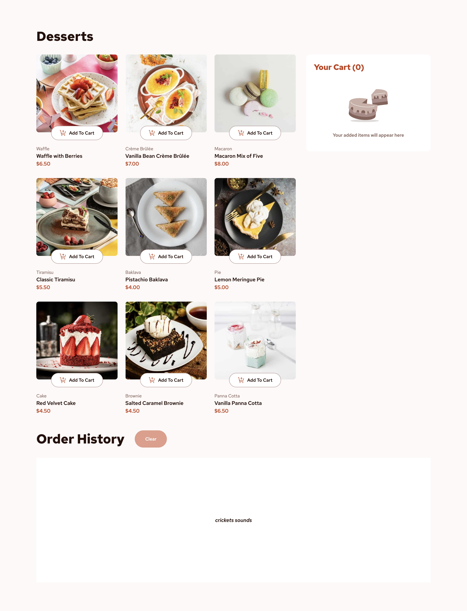
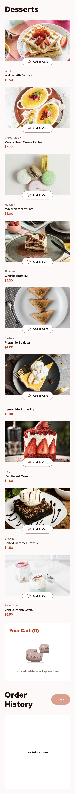

# Frontend Mentor - Product list with cart solution

This is a solution to the [Product list with cart challenge on Frontend Mentor](https://www.frontendmentor.io/challenges/product-list-with-cart-5MmqLVAp_d). Frontend Mentor challenges help you improve your coding skills by building realistic projects.

## Table of contents

- [Frontend Mentor - Product list with cart solution](#frontend-mentor---product-list-with-cart-solution)
  - [Table of contents](#table-of-contents)
  - [Overview](#overview)
    - [The challenge](#the-challenge)
    - [Screenshot](#screenshot)
    - [Links](#links)
  - [My process](#my-process)
    - [Built with](#built-with)

## Overview

### The challenge

Users should be able to:

- Add items to the cart and remove them
- Increase/decrease the number of items in the cart
- See an order confirmation modal when they click "Confirm Order"
- Reset their selections when they click "Start New Order"
- View the optimal layout for the interface depending on their device's screen size
- See hover and focus states for all interactive elements on the page

### Screenshot

Desktop

Tablet

Mobile

### Links

- [Live Site URL](https://product-list-with-cart.frilly.dev/)

## My process

At first, I wanted to build with `SolidJS`, but a lot of integrations and `@solidjs/testing-library`, `astro` and a bunch of stuff just aren't very compatible with each other. So I decided against it, and converted all SolidJS code to Vue.

### Built with

- [Astro](https://astro.build/)
- [Tailwind CSS](https://tailwindcss.com/)
- [Vue](https://vuejs.org/)
- [Nanostores](https://github.com/nanostores/)
- [Vitest](https://vitest.org/)
